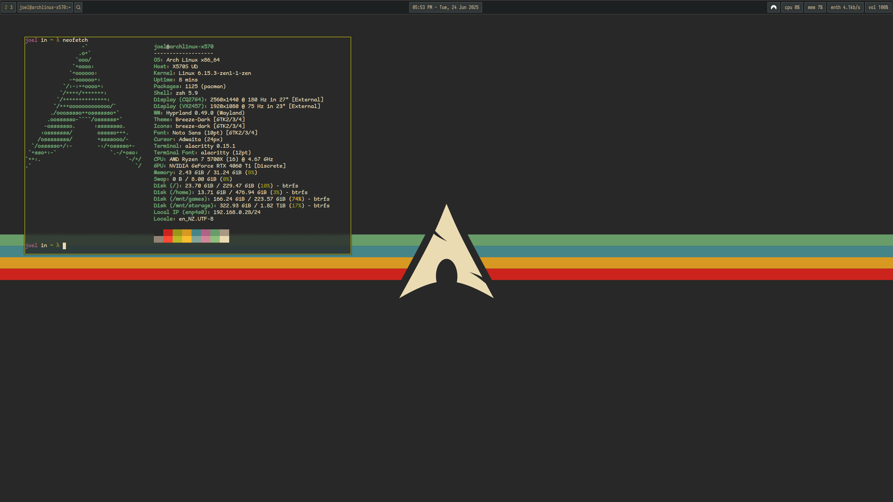

# Hyprgruv
A simple gruvbox themed hyprland config, w/ additional alacritty config.

# Installation
Run the `install.sh` script and it will create symbolic links in your `~/.config` directory.

# Dependencies

## Packages
- hyprpaper
- hyprpolkitagent
- hyprlock
- hypridle
- hyprland-qtutils
- waybar: status bar
- dunst: notification daemon
- wofi: application menu
- alacritty: terminal
- [rose-pine-hyprcursor](https://github.com/ndom91/rose-pine-hyprcursor)

## Fonts
- [Comic Mono](https://dtinth.github.io/comic-mono-font/) used as terminal font (aur: ttf-comic-mono-git)
- [Nerd Icons](https://www.nerdfonts.com/#home) used for icons in the status bar

## Plugins
- [hyprsplit](https://github.com/shezdy/hyprsplit)

# References
- wallpaper from [here](https://www.reddit.com/r/wallpaper/comments/ll1gov/arch_gruvbox_wallpaper_v2_dark_light_3840x2160/)
- waybar configured from Mubin's MinimalSway [config](https://github.com/mubin6th/MinimalSway/tree/main)
- dunst config taken from [here](https://github.com/xelser/gruvbox-dunst)
